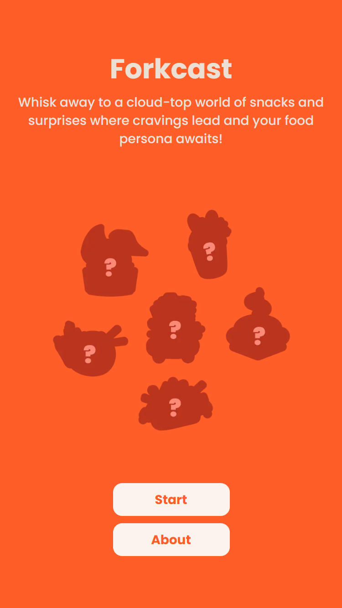

# Forkcast 🍜

Whisk away to a cloud-top world of snacks and surprises where cravings lead and your food persona awaits!



## About

Forkcast is a fun and interactive web application that helps you discover your food personality through an engaging quiz. Find out if you're a Big Bucks Bao, Talkayaki, Loco Taco, Flash Fry, Boba Babe, or Namastew!

## Live Demo

Check out the live application at [https://fork-cast.vercel.app/](https://fork-cast.vercel.app/)

## Local Development

### Prerequisites

- Node.js (Latest LTS version recommended)
- npm or yarn

### Getting Started

1. Clone the repository
```bash
git clone https://github.com/yourusername/forkcast.git
cd forkcast
```

2. Install dependencies
```bash
npm install
# or
yarn install
```

3. Run the development server
```bash
npm run dev
# or
yarn dev
```

4. Open [http://localhost:3000](http://localhost:3000) in your browser to see the application

## Tech Stack

- Next.js
- TypeScript
- Tailwind CSS
- Vercel (Deployment)

## Credits

- Design: [@viviantxh](https://www.instagram.com/viviantxh)
- Development: [Kent](https://github.com/kent12t)
